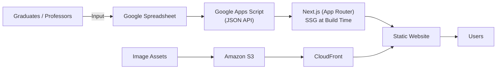

# IAMAS 2025 Exhibition Website

IAMAS（情報科学芸術大学院大学）卒業・修了制作展 2025 の公式Webサイトです。

<table align="center">
  <tr>
    <td align="center">
      
    </td>
    <td align="center">
      
    </td>
  </tr>
  <tr>
    <td align="center"><b>PC</b></td>
    <td align="center"><b>Mobile</b></td>
  </tr>
</table>

## Overview

本プロジェクトでは、卒業・修了制作展のWebサイト開発を1人で担当しました。

展示作品や作家情報は、卒業生・教員が入力するGoogleスプレッドシートをデータソースとし、Google Apps Script（GAS）経由でJSON APIとして配信しています。ビルド時にはNext.jsのStatic Site Generation（SSG）によってデータを取得し、静的サイトを生成する構成を採用しました。

また、展示作品の画像はAmazon S3で管理し、CloudFront経由で配信しています。PC・タブレット・スマートフォンなど様々なデバイスで快適に閲覧できるよう、レスポンシブデザインにも特にこだわって実装しました。

## Tech Stack

* Next.js (App Router)
* TypeScript
* Tailwind CSS
* AWS (S3, CloudFront)
* Google Apps Script (GAS)

## Features

* GoogleスプレッドシートをCMSとして利用
* GASを利用してスプレッドシートの内容をJSON APIとして配信
* SSG（Static Site Generation）による高速な静的サイト生成
* Amazon S3 + CloudFrontによる画像配信
* レスポンシブデザインを重視したUI実装
* 展示作品・作家情報の一覧／詳細ページ

## Architecture

## My Contributions

* Webサイト全体のフロントエンド開発
* レスポンシブデザインの設計・実装
* GoogleスプレッドシートとGASを用いたコンテンツ管理基盤の構築
* SSGによるデータ取得・表示機能の実装
* Amazon S3・CloudFrontを用いた画像配信基盤の構築

## Website

https://www.iamas.ac.jp/exhibit25/
